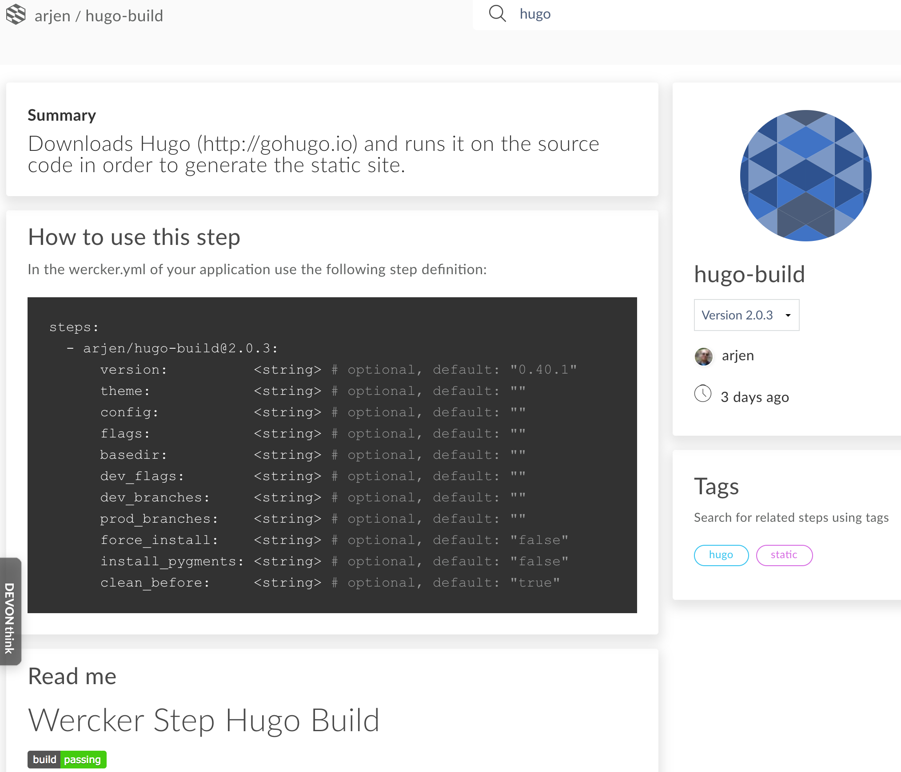

Earlier this April, the CI/CD service Wercker released their [new Steps Store](http://blog.wercker.com/steps-launch-of-new-steps-store). As I long ago built a step for generating Hugo sites like my own, I decided to upgrade it and see what has changed.

# The Steps Store

Let's first have a look at the new [Steps Store](https://app.wercker.com/steps) itself[^1], as that is what most people will interact with. A prominent link is shown at the top of the screen to go to the Steps Store, to ensure it's easy to find.

Once you go there, you get to see your own steps and recent releases.


It's nothing very exciting, but shows the information you need. Clicking through brings you to the details page where you get an overview of how to use the step, what the various parameters are, etc. Again, it's all the information that you need, displayed on a well-designed page.



Unlike a [certain other repository](/2018/03/publishing-to-the-serverless-application-repository/) I wrote about recently, the Steps Store has a good working search functionality that only shows relevant results. Which taught me that there are about ten copies of my hugo-build step, none of which seem to have bothered adjusting the README.md file[^2].

Not everything is great though, first, while the Steps Store works great on Chrome, it is less so on Safari. When using the browser's back button to return from a detail page, you end up seeing only placeholder boxes. In addition, the search box only shows the top part of any letters in there. While writing this, I sent some feedback about the issues, so hopefully this will be fixed soon. More importantly though, at least to a stats junkie like myself, is that it no longer shows how often your step was used. While I haven't paid a lot of attention to it lately, I still miss that information.

# Changes in Development

The most significant difference, and the main reason why I wanted to upgrade, is that Wercker steps are now built the same way as regular applications. No longer is it a separate build process using the old (original) Wercker boxes, but the builds now happen using regular Docker containers. This makes it a lot easier and more flexible to develop.

In fact, it solved an issue I recently had with the `hugo-build` step. As part of the step, I already install the latest two versions of Wercker, simply to speed the process up a little. At some point this year, however, GitHub updated their SSL certificate requirements, which meant that the old version of `curl` installed on the Wercker boxes was unable to download the releases. I first discovered that the new Steps Store was under construction at this time as some of the official Wercker steps had already implemented the changes for it[^3]. Unfortunately, it wasn't until several weeks ago that it became available for the rest of the world.

So, aside from being able to use proper Docker containers, what else has changed? The rest of the changes are relatively minor really. Obviously, you'll need to adjust your `wercker.yml` file. Not only to change the box to a new container, but to push your step to the store you will need to include the `internal/publish-step` step. The recommended place for that is in something like a `publish` pipeline so you can prevent it from being pushed when you're only testing things.

In the old steps, the manifest file was the `wercker-step.yml` configuration file. The manifest file contains all the information about your step, such as the name, required variables, version, etc. This file is renamed to `step.yml`, and some of the values have changed. `description` has become `summary` and `properties` has changed from a hash with the name as the key value to a list with the name value as part of the property object.

Old:

```yml
name: hugo-build
version: 1.30.0
description: |
    Downloads Hugo (http://gohugo.io) and runs it on the source code in order to generate the static site.
type: build
properties:
    version:
        type: string
```

New:

```yml
name: hugo-build
version: 2.0.0
summary: |
    Downloads Hugo (http://gohugo.io) and runs it on the source code in order to generate the static site.
properties:
    -   name: version
        type: string
```

Oh, and there is one other small thing you need to do if you wish to upgrade your step: you need to **delete** your old build pipeline and create a new one. This was something I had to check in their public Slack group because there is no documentation about how the upgrade process works. Apparently, there is no automated way to upgrade your existing step to a new one, so what you do is indeed deleting your existing step and creating a new one. If you keep the name the same in your `step.yml` file, publishing it again afterwards will update your existing step in the store.

The official documentation on building steps in the new system is on the [Creating Steps documentation page](http://devcenter.wercker.com/docs/steps/creating-steps).

# Teething problems

When I went through this, there were some... issues... shall we say. I wouldn't be surprised if I was the first person outside of the Wercker team to go through the upgrade process, considering what I ran into. That said, let me thank the Wercker team in advance for their help in the Slack channel and quickly resolving all of these issues. Especially Sergey Glushchenko was extremely helpful.

As I already mentioned, the first issue I had was just a lack of documentation. Nowhere was it mentioned that you have to recreate your step application before you can upgrade, and especially that doing so won't impact previously published steps.

Once I was aware of this, however, I thought it would be a matter of quickly doing so (as I'd already made most of the other changes already). At which point I ran into a bug. The `internal/publish-step` didn't work. In the interface it looked like it was just skipped. I tried a lot of things to fix it, believing that the issue was on my side. However, after I ran out of ideas and raised the problem, it turned out that, because of a bug in an unrelated feature, this step had been disabled in the Wercker codebase. Ok, I'd wasted time on it, but this kind of thing happens. And it wasn't too long before it was fixed. Well, I had to wait until the next day, but that was purely because of the time difference between myself and the Wercker team as they fixed it within 2 hours.

So, the next day I was all happy as the step built and was pushed up to the Steps Store...


And... there were two identical steps. Both of which had the details for the old one, and didn't show the new version I had pushed up. After some debugging and eventually more Slack (I had to wait until people in Europe woke up), this was again fixed by the Wercker team, and I now have a normal working and updated step available.

Obviously, running into several issues wasn't great, but I'm pretty sure that under the hood the Steps Store involved quite a significant change. And while we would all love it if software works perfectly the first time around, I've found that it's more important that a team can react quickly and fix things as they come up. 

Both of the above issues were found and resolved in a short amount of time. Which presumably involves the updated code going through a CI/CD pipeline[^4] before getting deployed into production. According to my chat logs, there were 3 minutes between the second issue having been identified and the fix being available in production. That's really fast and shows the strength of the microservices infrastructure that they're using.

Now, hopefully, most issues will have been resolved, so it should be pretty smooth sailing to build any more steps. Naturally, while I was making changes, I did some more things to warrant a 2.0 release of the `hugo-build` step, but that was mostly a matter of restructuring, no longer supporting outdated edge-cases[^5], and changing some default values. A complete list of breaking changes can be found in the [README](https://github.com/ArjenSchwarz/wercker-step-hugo-build), and if you want to look at the code changes there is a [pull request](https://github.com/ArjenSchwarz/wercker-step-hugo-build/pull/43) that contains them all.

[^1]:	You will need to be logged in to access that link.

[^2]:	I don't mind the copies btw, that's why it's on GitHub in the first place. It's just sloppy that they didn't update the README.

[^3]:	Looking at those steps is always a good way to find out how things work.

[^4]:	Guess which one...

[^5]:	You can no longer use Hugo versions before 0.21 with the 2.x releases of my step. Considering it's now at 0.40.1, that seems reasonable.