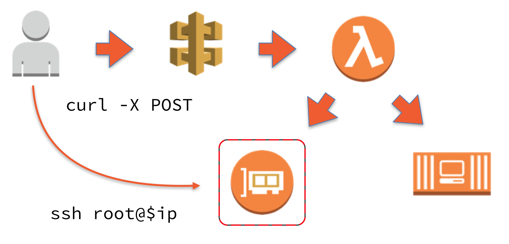
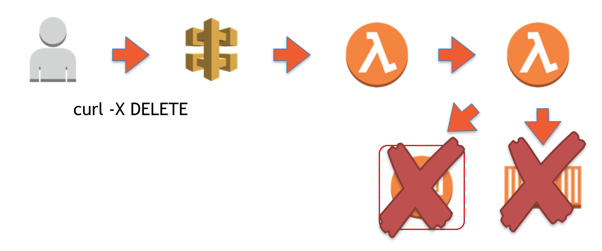

Fargate bastions allow you to spin up a bastion host[^1] only when you need it and tear it down afterwards. All using AWS serverless technologies, which means that you don't pay anything for them unless you actively use it. 

Everything I'm discussing here is available [on GitHub](https://github.com/ArjenSchwarz/fargate-bastion), so please feel free to try it yourself there or even follow the steps in [the workshop](https://github.com/ArjenSchwarz/workshop-fargate-bastion) I created for it. Follow up articles will dive deeper into the code, but today's focus is on the high-level picture of how it works.

# What problem does this solve?

While from a best-practice standpoint there is a move towards immutable instances that you can't log into, there are times or environments where this is not yet possible. In those cases you need to provide some sort of access to the environment, which preferably is tracked and made as secure as possible.

One way this is traditionally done is by using bastion hosts or jump boxes that serve as an entry point. These machines are the only publicly accessible endpoint, and you use them to get into the rest of the environment. While these bastion hosts are usually configured to be as secure as possible, they still pose a security risk. However, if these bastions only exist when needed, and are only accessible by a single person from a single IP, that makes them inherently more secure.

# The Access Pattern

The Fargate bastion access pattern means that you can create a bastion by accessing the endpoint of an API Gateway with your username specified. For example from your CLI you can run  

```bash
curl -X POST "https://abcdefg.execute-api.us-east-1.amazonaws.com/Prod?user=arjen"
```

This endpoint is linked to a Lambda function that first creates a security group, with port 22 open to your IP, and then runs a Fargate task with a public IP which has this new security group attached to it. The Docker image used by the Fargate task runs an SSH daemon and is specifically tailored to me[^2]. Which in this case means that it has my public key in the `authorized_keys` file for the root user of the container. This was baked into the Docker image, and not provided on boot.

The Lambda function eventually returns the public IP of the Fargate container so that you can access it immediately. Depending on the speed with which the Fargate container is deployed, you will have access to the environment in about 5 to 20 seconds[^3].



A similar functionality exists for removing the bastion when you're done with it. Once again you hit an endpoint

```bash
curl -X DELETE "https://abcdefg.execute-api.us-east-1.amazonaws.com/Prod?user=arjen"
```

that is linked to a Lambda function. As the deletion process takes longer than the creation, and generally exceeds the 30 second timeout that an API Gateway has, this Lambda function needs to invoke a different Lambda function. This function is then responsible for deleting the items in the correct order.



Lastly, there is a Lambda function that on a schedule checks if no bastions have been kept running for too long and automatically deletes them if that is the case.

# Further ideas

This access pattern is useful as it is, but it is a proof of concept meant to be easily taken and expanded upon. There are various ways this can be improved on. For example, instead of providing a username as a request parameter there could be a proper user interface tied into your company's authentication system or using a secret key. You can also make it create a Route53 record for your bastion once it comes up so you don't need to use an IP address.

Maybe in addition to spinning up the Fargate bastion, you want to use an SSM command to deploy that same public key to the servers you wish to access. Or perhaps you don't want to use a bastion at all but instead have it spin up a VPN server. I'm sure there are plenty of ideas out there so all I can recommend is to experiment and see what works for you.

[^1]:	Or jump box if you prefer that term.

[^2]:	Or you, if you were to run it.

[^3]:	There are occasions where the deployment takes longer. However, if it times out you can just call the function again and it will provide you with the IP that was created for you.