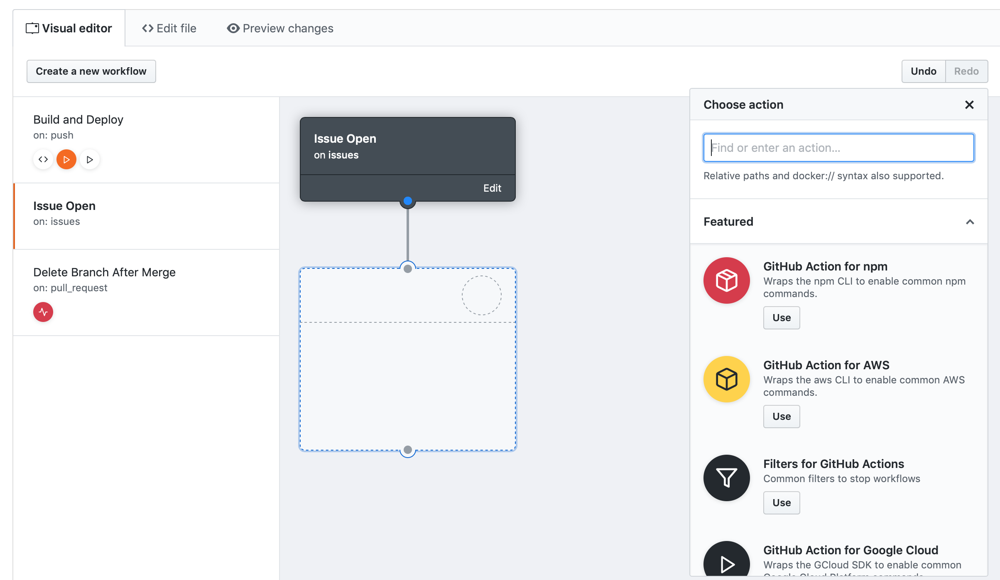
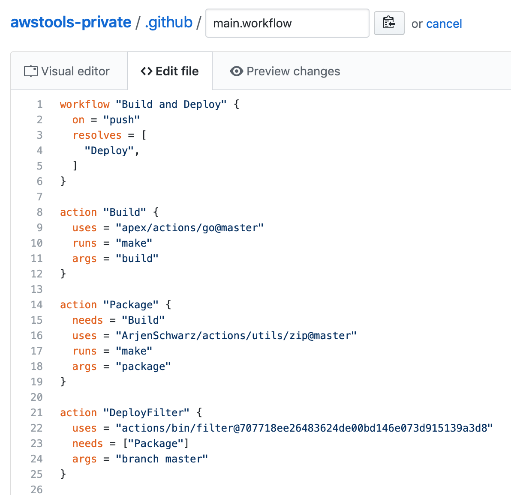

In October, GitHub announced GitHub Actions, their upcoming integrated solution for running automation triggered by things you do on GitHub. I would call it CI/CD, but that's only part of what it can do. I've had beta access for about 2 months now, but didn't really play around with it until around the Christmas period.

## Background

You may already know all of this, but let's start with a bit of background anyway. GitHub Actions lets you create workflows that consist of actions[^1], and they can be triggered by various events such as opening or closing of pull requests, creating or deleting branches, forking a repository, or even creating a wiki page. The number of [events that can cause a workflow to trigger](https://developer.github.com/actions/creating-workflows/workflow-configuration-options/#events-supported-in-workflow-files) is a bit insane[^2] and it's the main reason I don't want to call it a CI/CD tool. That just sounds too limiting.

A note on the naming as this can get a bit confusing. The feature itself is called GitHub Actions, but what you actually build is called a workflow that in turns consists of actions. I've noticed that people tend to mix and match the naming a bit, but in this post I'll try to adhere to the above[^3].

Jessie Frazelle wrote an [excellent and entertaining blogpost](https://blog.jessfraz.com/post/the-life-of-a-github-action/) about how a GitHub Action behaves, and I highly recommend that you read that for a concise description of how it works. I'll cover some of the same ground, but you should really read that first.

During the beta period most of the functionality is only available for private repos. On 19 December, GitHub opened up the `push` event to public repos and until the recent [announcement of free private repos](/weekly-notes/week-3-2019/) that is what I was playing around with. As I don't have any personal repos at the moment[^4], I ended up duplicating one of my public repos so I could use the full set of features.

## Building a workflow

So, let's start with building a workflow. While I generally like to use code or the CLI to configure things, the visual editor for building GitHub Actions is really good[^5]. A nice and simple drag and drop interface that takes care of the underlying complexity for you. It starts with choosing a name for the workflow and defining what event should trigger it[^6]. Then you can drag from this starting block to one below it to create a new action and choose what that should be.

Before going into more detail on the actions, I just want to point out the section on the left in the editor. There you can see multiple workflows. These are all managed from the same `main.workflow` file in your `.github` directory, but in the visual editor they're nicely separated. Personally, I would have appreciated the ability to have multiple workflow files for separating functionalities, but hopefully that will come in the future[^7].

One small issue with the drag and drop interface is the way it adds actions to the `main.workflow` file. In particular, it always adds them at the bottom instead of grouping it by workflow. The order doesn't actually matter so in that regard it's not an issue, and it makes diffs a bit more readable, but it also means that your workflows can be completely spread out across a file. This is mainly an issue if you mix and match how you edit them, and of course there's nothing stopping you from organising it again afterwards.

Going back to the actions, when you create it through the visual editor you get the option to choose one of the featured ones[^8] or provide a URL. This URL allows one of three possible types:

1. An action in a separate GitHub repo.
2. An action that is in the same repo as the project.
3. A public Docker image, for example on Docker Hub[^9].

Of these, the first 2 are basically the same except for the path. Personally I think that unless you have a very good reason, you should put your actions in a separate repository so you can easily reuse it. Using a public Docker image is certainly an interesting option as well, but playing around with it I got mixed results and just ended up using actions.

Once we've picked our source, we can then provide secrets and environment variables or even override the `runs` and `args` of the action. These two are the values of the endpoint and command in Docker respectively.

After this you just connect the next action in your chain (or a parallel one) and continue building your workflow until you're done.

Now, even if you decide to use drag and drop to build all of your workflows, I recommend looking through the source code as it reveals a couple of things and how they work.

## Diving into the workflow

In the below example I'm using the same file I was editing above. You may notice a couple of interesting things in here.

First, while I didn't mention it above, you need to define the version of the action you wish to run. Usually you would pick `@master`, but this is GitHub so you can also pick a branch, tag, or even a specific commit. Looking closely you can see that I generally used `@master`, but for the filter action[^10] I dragged it in from the featured actions so GitHub gave me a commit specific one. I completely agree with doing so for featured actions as it prevents a malicious actor from changing the action. In fact, in general it's probably a good idea to use something that's not master unless you trust the source.

The syntax itself is simple and clear, but takes some getting used to as it flows backwards. The workflow `resolves` the final nodes[^11] and each of these nodes will then say what it depends on, or `needs`. It's a clean way of dealing with parallel paths and means that the position in the file isn't important. But let's look a bit closer at the actions themselves now.

## The power of actions

In essence an action is a Docker image, but you don't have to push it up to a repository. All you need is a Dockerfile. And I mean that literally, the smallest action I've created consists of only a Dockerfile that installs what I need in the container[^12]. Generally you will need more than that though, and the recommended way is to have an `entrypoint.sh` file that is used as the default command.

While actions are expected to have a default entrypoint and command, you can always override that. So you may build or use an action that by default will run a certain command, but if you have a `Makefile` in your project that has the command ready to go it might be easier to use that instead of typing it out again in your workflow.

So, if you don't need to provide built Docker images you'll likely realise that this gets built at the time an action runs. This makes it a bit slower, although the builds are pretty fast, but if that's not fast enough you can of course just use images. Having it compile only on run does mean you might want to be a bit more careful about using `:latest` in your FROM statements or exactly what version of a dependency you're installing.

Unsurprisingly, one of the biggest strengths of GitHub Actions is its integration with GitHub. By default you can provide every action with a `GITHUB_TOKEN` secret that the action can then use for any interaction with GitHub that may require authentication. I'm sure you can think of ways this can be useful, but as an example I use it in several of my actions to use the GitHub API to find the latest version of an application and pull that in. Yes, you can do that without authentication, but then you quickly run into API rate limits which is never fun.

And all of this also means that you can easily fork or copy every action you find and make your own version of it. Of the actions I've made, most are inspired in one way or another by another action. Some are straight copies with a small change, while others may only use similar structures.

## The full experience

As I said, I've mostly used GitHub Actions for my public projects but that doesn't mean I'm not looking forward to everything else it can do. Especially when you get to projects with a lot of collaboration in your organisation, there are good opportunities there. For example, I can easily see a vulnerability alert in a Ruby project triggering the following workflow:

1. Create a new branch
2.  Run `bundle update`
3. Create a pull request with the new `Gemfile.lock`
4. Send a message to the company's #security Slack channel to ask for a review.

Keep in mind here that this PR probably won't trigger GitHub Actions to run as GitHub Actions can't trigger other GitHub Actions.

Or if you'd like another idea, how about a workflow that triggers a wiki page to be updated when you release a new version of your project? Or the other way around? In all honesty, I wouldn't be surprised at all if someone has already written actions that do some of these things.

If you don't have access yet, you might not be aware that right now it's not possible to see any GitHub Actions in other accounts. Obviously you can see their `main.workflow` file, but not the history of the runs. I don't know if this is a beta limitation or a security feature[^13], but it means you can't see what is being run. They do show up in the status checks of Pull Requests, but other than that it's invisible.

## Some useful things to get started

Usually you'll have different paths you want your workflow to take based on the branch that triggered it. A common case is that you want to test your code in every branch but only do a deployment from master. This can be achieved with the filter action I referred to earlier. The filter is part of a set of actions provided by GitHub in their [actions organisation](https://github.com/actions), specifically it's part of the [actions/bin](https://github.com/actions/bin) repository.

The filter action uses a third state[^14] that is defined as neutral in GitHub Actions. This is triggered by exit code 78 so you can use it to implement your own filters as well. When this state is triggered it will cancel all following actions in the chain, marking them as Neutral. This is different from marking them as failed[^15], and is therefore useful to ensure actions are only triggered in some cases. I recommend reading the [README file](https://github.com/actions/bin/blob/master/filter/README.md) to see all the ways you can use the filter.

The [actions/action-builder](https://github.com/actions/action-builder) repo holds several tools aimed at helping you build and test your own actions. Use those. They will make your life easier.

Pick [fun colours and icons](https://developer.github.com/actions/creating-github-actions/creating-a-docker-container/#label) for your actions. You have some control over what it looks like in the UI so there's no need to limit it to the default. Aside from being more fun, it also helps in being more recognisable.

Learn from others. Many excellent (and less so) actions have already been written and they're worth having a look at to see how it all works. Someone [created a list](https://github.com/sdras/awesome-actions) already and while it hasn't been updated recently, the pull requests have more. Play with these, use them, or copy them as a basis for your own actions.

## How does it hold up?

It's been almost 3 years since I wrote a [similar piece](/2016/05/bitbucket-pipelines-a-first-look/) about Bitbucket Pipelines and I ended up with a wish list of things I wanted to see improved[^16]. Where it comes to GitHub Actions I don't have a list like that. All the things I generally want are available and work really well. Oh, I can say that I would really like the full capabilities in public repos, but I suspect that's currently because its still in beta.

One small downside I can mention is that there's no way to trigger a build manually. In practice that's not really a concern though. GitHub Actions is super flexible and you can turn it into anything you want[^17], and personally I have moved everything over from Wercker[^18].

The biggest questions I've got are around availability. Will this become available to everyone for free? Will there be limits based on your account type[^19]? Questions like that. I'm sure that answers to these will come in time though, so for now I recommend to have fun when playing this new cool toy.

Let me know if I missed anything obvious, or if you have any questions, and I'll do my best to answer them.

[^1]:	That must have come as a shock.

[^2]:	In a very good way.

[^3]:	Which has caused me a lot of editing.

[^4]:	Some time ago I realised that nobody cares about my unfinished projects, so why go through the trouble of hiding them?

[^5]:	And besides, the article above already did it all by code.

[^6]:	Except, as mentioned before, with public repos.

[^7]:	Because of how polished GitHub Actions looks, I sometimes have to remind myself this is still only a beta.

[^8]:	Currently all provided by GitHub, but I assume that might expand after release.

[^9]:	I think you can use a private docker repository, but I don't think there's a secure way to provide authentication for those so probably not a good idea right now.

[^10]:	I'll come back to this one in a bit, as it's very useful.

[^11]:	Yes, you can have multiple end nodes.

[^12]:	It's a [pretty silly one](https://github.com/ArjenSchwarz/actions/tree/master/utils/zip), but I needed a lightweight way to zip things.

[^13]:	A case can be made both ways.

[^14]:	In addition to the regular success (exit code 0) and fail (every other exit code).

[^15]:	Although for a while these would show up as failed in pull requests. That's now been fixed though.

[^16]:	I believe all of those have been implemented since.

[^17]:	Unless you're stuck with Windows jobs.

[^18]:	I was looking for something new since their acquisition by Oracle anyway.

[^19]:	It seems fair to me that paying users get more.