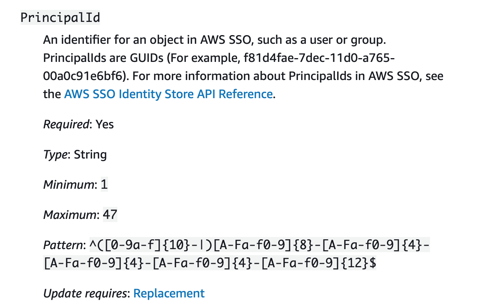

A couple of weeks ago, the AWS SSO team finally released functionality I've been anxiously waiting for: a (limited) API and CloudFormation support!

If you're confused by that statement, I don't blame you. We've all heard the stories how everything within AWS is API-driven and often features are available in the API before they exist in the Console. Unfortunately that's not always the case and there are several services[^1] that are Console only. I'll be honest, the pain of not having an API for a service makes the usual delayed availability of CloudFormation seem like a paper cut in comparison[^2]. As anyone who knows me personally can attest to, I don't deal well with needing to do the clicky-click thing.

But enough about my hurt feelings, we have (some) support in CloudFormation so let's see how well that works. And what we can do to work around the issues.

## AWS::SSO::PermissionSet

There are two CloudFormation resource types available for SSO at this stage, and [AWS::SSO::PermissionSet](https://docs.aws.amazon.com/AWSCloudFormation/latest/UserGuide/aws-resource-sso-permissionset.html) is the first of these. If you're not familiar with a PermissionSet in SSO parlance, it's basically an IAM Role with the addition of a relay state type (which allows you to set the start page when you assume the Role).

At first glance, the template structure looks pretty good. Giving everything we want and need for a permission set.

```yaml
Type: AWS::SSO::PermissionSet
Properties:
  Description: String
  InlinePolicy: String
  InstanceArn: String
  ManagedPolicies:
    - String
  Name: String
  RelayStateType: String
  SessionDuration: String
  Tags:
    - Tag
```

That is, until we look closely at the InlinePolicy mentioned there. This is exactly what you'd expect, the (single) inline policy that you can attach to a permission set. Unless you are in the rare situation where you can make do with only managed policies[^3] this is where you do most of your configuration. But it's of type **String**. Yes, you're expected to provide your entire policy as a string. No validation until you send it to CloudFormation, and obviously it looks incredibly ugly in your template. Regardless of whether you like to write in YAML or JSON.

Let's see what that looks like with a short policy:

```yaml
Resources:
  ExampleSet:
    Type: AWS::SSO::PermissionSet
    Properties:
      Name: ExampleSet
      InstanceArn: !Ref SSOInstance
      InlinePolicy: |
        {
          "Version": "2012-10-17",
          "Statement": [
            {
              "Effect": "Allow",
              "Action": "*",
              "Resource": "*"
            }
          ]
        }
```

and in JSON where we have the added joy of needing to escape it:

```json
  {
    "ExampleSet": {
      "Type": "AWS::SSO::PermissionSet",
      "Properties": {
        "Name": "ExampleSet",
        "InstanceArn": {
          "Ref": "SSOInstance"
        },
        "InlinePolicy": "{\"Version\": \"2012-10-17\", \"Statement\": [{\"Effect\": \"Allow\", \"Action\": \"*\", \"Resource\": \"*\"}]}"
      }
    }
  }
```

Yeah, now imagine having to use that to manage policies that contain dozens of statements and many lines of policy. As it happens, I don't have to imagine as I tried it. And then gave up and decided I wanted a proper solution for this. So, I did what I usually do in these situations and created a new [CloudFormation Macro](/2018/11/building-and-testing-cloudformation-macros/). My wish for this was very simple: make it so the policy is treated as a PolicyDocument in an IAM Role.

My solution is based on one I've used before; overload the PermissionSet resource type by adding a `PolicyDocument` resource and in the Macro inject this into the InlinePolicy. You can find the complete Macro [on GitHub](https://github.com/ArjenSchwarz/cloudformation-macros/tree/master/SSOFixer), appropriately named SSOFixer, but the relevant part of the code that does the work is this:

```python
for resource in list(fragment["Resources"].keys()):
        # Turn Permission Set PolicyDocument into InlinePolicy
        if fragment['Resources'][resource]['Type'] == 'AWS::SSO::PermissionSet':
            if "PolicyDocument" in list(fragment['Resources'][resource]["Properties"]):
                policy = json.dumps(fragment['Resources'][resource]['Properties']['PolicyDocument'])
                result['Resources'][resource]['Properties']['InlinePolicy'] = policy
                result['Resources'][resource]['Properties'].pop('PolicyDocument')
```

As CloudFormation already translates it into JSON for me, I only need to turn that into a string, put it in the InlinePolicy and get rid of the PolicyDocument. This was remarkable easy to implement in a couple lines of code of Python, so let me be clear here for the SSO team: Please feel free to take inspiration[^4] from this solution, I promise you that nobody is going to complain about having more readable CloudFormation.

This means I can now put that same policy in my code like this:

```yaml
  ExampleSet:
    Type: AWS::SSO::PermissionSet
    Properties:
      Name: ExampleSet
      InstanceArn: !Ref SSOInstance
      PolicyDocument:
        Version: 2012-10-17
        Statement:
          - Effect: Allow
            Action: '*'
            Resource: '*'
```

Much better! And as I tend to use [cfn-lint](https://github.com/aws-cloudformation/cfn-python-lint) for validating my CloudFormation, it was pretty straightforward to add a [spec override](https://github.com/ArjenSchwarz/cloudformation-macros/blob/master/SSOFixer/cfn-lint/override-file.json) as well as a [custom rule](https://github.com/ArjenSchwarz/cloudformation-macros/blob/master/SSOFixer/cfn-lint/rules/SSOPolicy.py) that runs validation over this PolicyDocument[^5].

And with that small change I'm suddenly happy with the PermissionSet resource again.

## AWS::SSO::Assignment

The second resource that's available is [AWS::SSO::Assignment](https://docs.aws.amazon.com/AWSCloudFormation/latest/UserGuide/aws-resource-sso-assignment.html). This again does exactly what you expect. It matches a permission set, account, and user or group together to manage their access.

Looking at the structure it's again pretty nice and should work well.

```yaml
Type: AWS::SSO::Assignment
Properties:
  InstanceArn: String
  PermissionSetArn: String
  PrincipalId: String
  PrincipalType: String
  TargetId: String
  TargetType: String
```

Everything is a string, but that's ok for this as we don't need any type of object. But I wouldn't be talking about this if I didn't have a tiny issue. Let's look at the documentation for the PrincipalId property.



It uses GUIDs... Now, I can understand the logic for that; a GUID is a truly unique identifier, so if you have 10 people named John Snow you can make sure the correct know-nothing gets the permission. But that doesn't change that when managing permissions for hundreds of people I can't deal with a string like *f81d4fae-7dec-11d0-a765-00a0c91e6bf6* to serve as identifier.

To make it even more fun, the only place you can see these identifiers when using the built-in identity store is in the URL when you look at a principal.



Now, user management for more than 10 people is a terrible experience with the built-in identity store (see my earlier clicky-click comments) and at least when you use Active Directory as a backend you can easily find the GUIDs (although in SSO they will be prefixed by the AWS id of the AD, minus the `d-` part).

As it happens, there are perfectly fine readable unique identifiers in identity stores. So in order to keep myself sane, and the security team happy, the best solution I could come up with was a lookup table. Indeed, I simply provide the name of my user or group in a new PrincipalName property and let the Macro convert that into the unreadable ID that SSO wants. Again, this is done using the [same Macro](https://github.com/ArjenSchwarz/cloudformation-macros/tree/master/SSOFixer) I linked to before.

There are different ways to do something like this, a DynamoDB table[^6] would work for example, but I went with the easiest one to manage: a JSON file on S3. The file looks like this:

```json
{
    "TestGroup": "97672cb23f-6bcb55b9-9ba0-4684-9a23-7f07a8b59e3b",
    "OtherGroup": "97672cb23f-6bcb55b8-9ba1-4685-9a24-7f07a8b59e3c"
}
```

and after it's loaded in the Macro's Lambda function it only needs to do the same kind of dance as mentioned earlier.

```python
    for resource in list(fragment["Resources"].keys()):
        if fragment['Resources'][resource]['Type'] == 'AWS::SSO::Assignment':
            if lookups == True and "PrincipalName" in list(fragment['Resources'][resource]["Properties"]):
                result['Resources'][resource]['Properties']['PrincipalId'] = lookupdict[fragment['Resources'][resource]["Properties"]["PrincipalName"]]
                result['Resources'][resource]['Properties'].pop('PrincipalName')
```

And with that I can have an assignment like the below where I use readable names.

```yaml
  Assignment:
    Type: AWS::SSO::Assignment
    Properties:
      InstanceArn: !Ref SSOInstance
      PermissionSetArn: !Ref PermissionSetArn
      TargetId: !Ref TargetAccount
      TargetType: 'AWS_ACCOUNT'
      PrincipalType: 'GROUP'
      PrincipalName: 'TestGroup'
```

Of course, I still need to generate the lookup table. But with a little bit of Powershell magic[^7] that's fairly easy for an AD-backed SSO instance[^8]:

```pwsh
$Output = @()
$prefix = "abcd123456-"
$searchBase = "OU=SuperOrg,DC=directory,DC=ig,DC=nore,DC=me"
Get-ADUser `
        -SearchBase $searchBase `
        -Filter * `
        -Properties Name,DistinguishedName | ForEach {
            $Name = $_.Name
            $GUID = $_.ObjectGUID
            $Output += "`"${prefix}${GUID}`":`"${Name}`""
        }
Get-ADGroup `
        -SearchBase $searchBase `
        -Filter * `
        -Properties Name,DistinguishedName | ForEach {
            $Name = $_.Name
            $GUID = $_.ObjectGUID
            $Output += "`"${prefix}${GUID}`":`"${Name}`""
        }
echo "{" ($Output -join "," | Out-String) "}" > output.json
```

So, with both of these issues resolved you'd think all is well. And perhaps that is the case for some identity stores, but there is a major bug for at least AD-backed SSO instances[^9].

## The bug

Let's start with a disclaimer, I filed this bug with the SSO service team last week and I know they're looking into it. That said, if you've run into the same issue please let them know through your TAM/SA/friend at AWS to bump the priority of this issue.

Below I've pasted the bug report as I filed it, with some possibly NDA speculation about the reason and identifying details removed.

```
Issue:
With SSO's CloudFormation implementation, when using Active Directory as backend, you can't use AWS::SSO::Assignment with an AD group that hasn't previously been assigned to a permission set using the Console. The API has the same issue when using the aws sso-admin create-account-assignment command. After adding the group manually to a different permission set (and then removing that access again), the exact same CloudFormation template or API command works.

How to reproduce:
Use an AD backed SSO instance.
1. Create a new group in AD.
2. Try to assign the groups to an account and permission set using either CloudFormation or the API.
3. Watch this fail.
4. Add the group manually to a permission set using the Console and remove the group again from that permission set afterwards
5. Run the same commands as step 2
6. Watch it succeed

Expected behaviour:
The assignment happens in step 2 without needing to do things in the Console

Actual behaviour:
Error messages like the below occur
Error occurred during operation 'Request <redacted> failed due to: Received a 404 status error: the GROUP assignee <redacted> was not found in directory d-<redacted>'.

Impact:
Critical, it makes the API and CloudFormation more or less useless
```

What this means is that while in theory I can now manage all these permission sets through CloudFormation, in practice I still need to do a lot of clicky-click to make it work. And that makes me sad.

## The CloudFormation syntax

Instead of staying sad, let's have a look at what the CloudFormation documentation tells us about the properties we have available and get some enjoyment out of that[^10].

For the **InstanceArn** property we get the following limitations:

```
Minimum: 10
Maximum: 1224
Pattern: arn:aws:sso:::instance/(sso)?ins-[a-zA-Z0-9-.]{16}
```

That maximum definitely seems like it could be reached, so let's see how that is for other things, such as **PermissionSetArn**

```
Minimum: 10
Maximum: 1224
Pattern: arn:aws:sso:::permissionSet/(sso)?ins-[a-zA-Z0-9-.]{16}/ps-[a-zA-Z0-9-./]{16}
```

I guess we can get a bit closer to the maximum here. But how about **SessionDuration**?

```
Minimum: 1
Maximum: 100
Pattern: ^(-?)P(?=\d|T\d)(?:(\d+)Y)?(?:(\d+)M)?(?:(\d+)([DW]))?(?:T(?:(\d+)H)?(?:(\d+)M)?(?:(\d+(?:\.\d+)?)S)?)?$
```

I know people like having reasonably long sessions, but to me this pattern and its maximum size reads like you can set it to last until quite a while after the heat death of the universe.

Okay, while these things make for some (very geeky) fun, what I would actually have preferred is that the CloudFormation abstracted the API a bit more. It's already better than the pure API but a couple of improvements (aside from those I fixed) would be nice:

* As we can only have a single SSO environment available[^11] why do we need to define the instance ID in every template?
* Even if you want us to define the instance ID in the permission set, why also in the assignment where we already provide the permission set ARN which includes the instance ID?
* When the assignment type is clearly defined to only work with permission sets and accounts, why do we need to define the type of target when the only allowed value is **AWS\_ACCOUNT**?

Yes, I'm aware I can fix each item on this list with a Macro, but they aren't quite as annoying as the ones I implemented so I didn't bother yet. These are just the considerations I'd like to see taken into account when CloudFormation templates are designed.

Oh, and while we're at it, having support for [importing permission sets into a stack](#) would have been awesome when it first came out. It will still be great if it comes out soon-ish.

If you read this far, I'd love to hear if I'm the only one who thinks like this, or even if you have some other annoyances about the SSO CloudFormation that I didn't mention.

[^1]:	Interestingly, several of these have recently gotten API support.

[^2]:	Although obviously I'll happily cry about that papercut.

[^3]:	I admit, that's me for some of my personal AWS Organizations/SSO setups as I just give myself Administrator. And yes, I'm well aware that's not exactly a good idea.

[^4]:	Or literally copy it.

[^5]:	Speaking of taking inspiration, this custom rule is a literal copy and paste job from cfn-lint's inbuilt Policy validation rule.

[^6]:	Even [SimpleDB](https://github.com/aws/aws-cli/pull/5199) would be sufficient.

[^7]:	Words I never expected to write.

[^8]:	Other identity stores are left as an exercise for the reader.

[^9]:	I don't currently have access to one backed by other external stores to test if it's the same. If you do, please let me know.

[^10]:	This is not to be taken too seriously obviously, but some of this made me laugh.

[^11]:	I wouldn't mind having a second one available for testing though.