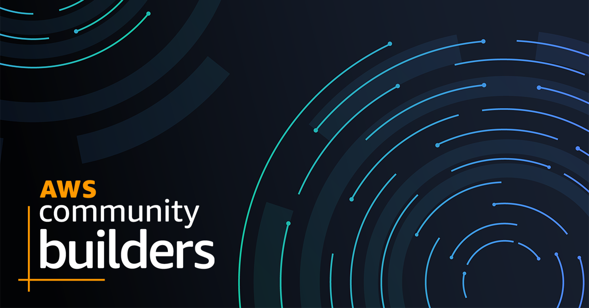

---
Categories:
- Opinion
Slug: aws-community-builder
Author: Arjen Schwarz
Title: AWS Community Builder
date: 2023-02-27T09:36:22+11:00
summary: "I'm happy to announce that I'm now part of the AWS Community Builder program, in the Dev Tools category."
ogimage: https://ig.nore.me/2023/02/aws-community-builder/cb-social.png
---
I'm happy to announce that I'm now part of the AWS Community Builder program, in the Dev Tools category. In case you're not familiar with the [Community Builders program](https://aws.amazon.com/developer/community/community-builders/), it is a program that offers resources, education, and networking opportunities for those who are active in the AWS community. It is also a program you need to apply for yourself, during one of the periods it's open for applications. In the meantime, there is the option to put yourself on the waitlist.

In a way though, that makes this the third such program I'm a member of. First, I've been in the AWS Ambassador (formerly APN Ambassador[^namechange]) program for a long time, and the Cloud Warrior program that fed into it before that. Then in 2019 I became an AWS User Group Leader, or Organiser, which while not entirely defined as a program similar to the others is sort of run like it. So, aside from just mentioning that I'm now a Community Builder this post will go over some of my thinking about joining the program. And at the end I've included some updates regarding social media.

[^namechange]: This is a name change that I 100% support by the way. Being an APN (AWS Partner Network) Ambassador always required explanations of what that actually is as nobody outside of the partner network actually knows that acronym, and AWS APN was obviously redundant enough that I didn't want to use it.

## Why join yet another program?

Because it sounded like fun. I know a fair number of people both in Australia and elsewhere who have been part of the Community Builders program for a while now and they are enjoying it. In addition, it's something new to try out and see how the program works. And joining it was relatively straightforward, it's basically a form asking you why you want to join the program, which two categories you want to be in (Dev Tools was my first choice) and you need to show that you've actually contributed to the community. Despite my lack of writing on this site, I have done quite a bit of that ,and obviously anything that counts as a community contribution for the Ambassador program counts for the Community Builders program as well, including all the things I do as a User Group Leader[^cheating].

[^cheating]: Yes, it almost seems like cheating.

## Why now?

That's a good question. If it's relatively easy for me to enter this program why would I wait until now? The answer is two-fold. On the one hand there is the excuse of having a young child and not wanting to pick up more things like this, but the truth is more likely that I was too lazy and didn't want to join yet another program. But as I said, I kept hearing good things about the program and figured it was time to see for myself what's in there.

## What does it really mean?

I can show another badge on this website and get some more swag? No, in all seriousness I'm actually looking forward to learning more about what the program actually means in practical terms. While hearing things is nice and the website has a nice spiel, it's always finding out what it actually does that matters. To be honest though, mostly I'm hoping to meet new friends who I can talk to about a lot of this fun stuff and maybe collaborate on some things on.

## What are some examples of things you do?

I'm so glad you asked! I haven't been very good about posting things here and while I intend to catch up on that, I'll put a summary of some of these things here:

### Events

Obviously I'm still running (with help of course) the [Melbourne AWS User Group](https://melb.awsug.org.au) every month, but in addition I'm one of the organisers for [DevOpsDays Melbourne](https://devopsdays.org/events/2023-melbourne/welcome/). A conference we started organising in 2019 with the plan to run it in 2020. And then the world fell apart, but it's now only 2.5 weeks out (16-17 March). There are still tickets available, so come along!

### Open Source

The open source code I've worked on the most over the past couple of years is likely [fog](https://github.com/ArjenSchwarz/fog). I've spoken about this at various venues, but in essence it's a tool for managing your CloudFormation. It allows you to CloudFormation deployments in a better way, but it also lets you get an overview of deployments that have happened. This is a tool that originally started its life as a bash script many years ago that I finally ended up re-writing in Go to make it more useful and nicer to work with. And I'm still working on improving it, currently I'm adding a functionality that provides better drift detection than the standard one from CloudFormation[^local].

[^local]: This is very much in a "it works on my machine" state right now, but I'm quite happy with the way it handles tag changes and shows drift for NACL entries.

In addition, I've been making improvements to my still terribly named [awstools](https://github.com/ArjenSchwarz/awstools) and ended up splitting the formatting/output part of it into its module named [go-output](https://github.com/ArjenSchwarz/go-output)[^naming] that is used by both awstools and fog.

[^naming]: I suspect that between these two my naming skills are clearly of a level that I would fit right in with the people naming services at AWS.

### Podcasts

While the [Melbourne AWS User Group podcast](https://podcast.awsug.org.au) had a bit of a hiatus, we started season 2 back up after re:Invent. The cast of the podcast has changed a bit, but we have a good group of people who like to make fun of things where needed, but also know what they're talking about. So, exactly the kind of thing you want in a podcast. The first episode of season two is embedded below, and you can follow through for the second one (a third should be recorded not too long in the future).

<iframe title="re:Invent 2022" allowtransparency="true" height="450" width="50%"
                    style="border: none; min-width: min(100%, 430px);" scrolling="no" data-name="pb-iframe-player"
                    src="https://www.podbean.com/player-v2/?i=a3et8-1335f74-pb&square=1&share=1&download=1&rtl=0&fonts=Arial&skin=1&font-color=auto&btn-skin=ff6d00&size=600"
                    allowfullscreen=""></iframe>

### Presentations

I've given a couple talks, but my favourite that I haven't put up here yet was at the User Group in Perth. Not only did it give me the chance to visit Western Australia but it was great to interact with the community there.

{}

## So, what's this about social media?

Apologies for tacking this on at the bottom here, but this way I don't need to do a separate post about it. Basically, many of you will likely have heard that Twitter is currently in a weird state. In fact, between no longer being able to use my preferred third-party clients and other questionable decisions, it's in a state where I personally don't really want to use it anymore.

If you follow updates to this site through the [bot account on Twitter](https://twitter.com/ignoreme-site), that should still work as I write this (and otherwise you might never read this), but I honestly don't know if it will continue to work long-term. I do know that I won't be paying to use the API. So, instead I set up a personal Mastodon instance that I will be using for my personal account ([@arjen@ig.nore.me](https://mastodon.ig.nore.me/@arjen)) as well as any bot accounts, like one for this site ([@feed@ig.nore.me](https://mastodon.ig.nore.me/@feed)), that I want to have. In addition, I will be more active on LinkedIn and have created a ["company" page for the website](https://www.linkedin.com/company/ig-nore-me/) as well where everything will automatically be posted.

