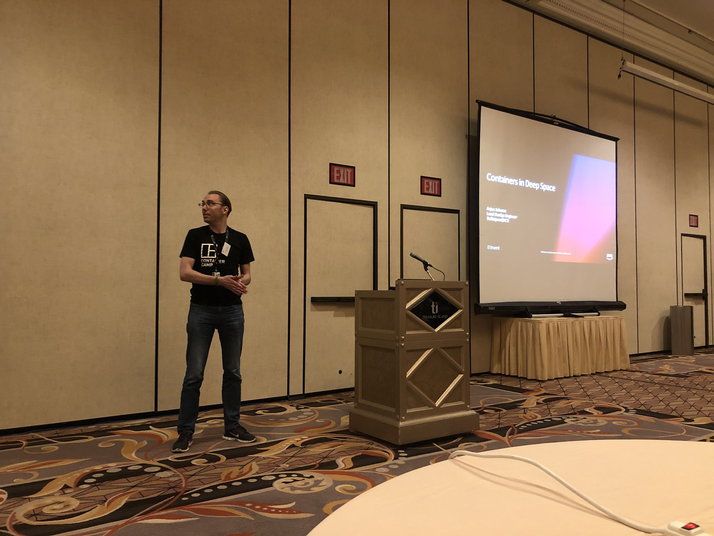

At the AWS Ambassador day during re:Invent I gave a lightning talk about Fargate that went a bit deeper than my previous talks. If you're not yet very familiar with Fargate, it might make sense to have a look at the contents of [those other talks](/presentations/2018/11/space-containers/) first.



# Black Magic

Fargate is a lot of fun to use, but one of the drawbacks of it being a serverless solution is that we don't have any insight into what our containers run on. Presumably it's on EC2 instances that are managed by AWS, but for all we really know it could be running on black magic. While that would be cool, I do prefer to believe they are just regular instances floating somewhere above us in space[^1]. So, what I want to show today is some ways to get the information you need and what you can use it for.

Regardless of how much things are hidden, there are always ways to find out more information and we have been provided some of that in the way of metadata endpoints. Similar to the EC2 metadata endpoint, these two endpoints can be called with a cURL[^2] call to give us either statistical information or pure metadata.

```bash
curl 169.254.170.2/v2/stats
curl 169.254.170.2/v2/metadata
```

# The Stats Endpoint

When calling the stats endpoint you get a JSON blob back, and when you parse that into something readable with a tool like jq you will find that you get over 300 lines of JSON per running container, and you will get the information for all the containers running in the task. Below is a partial sample of one such call.

```json
  "4195092261f726c026b0a86820060d2560085d7b158efb4721910feb4354d1c8": {
	    "read": "2018-11-23T00:23:49.431731172Z",
	    "preread": "2018-11-23T00:23:48.427533626Z",
	    "num_procs": 0,
	    "pids_stats": {},
	    "network": {},
	    "memory_stats": {
	      "stats": {
	        "cache": 6127616,
	        "mapped_file": 2072576,
	        "total_inactive_file": 1556480,
	        "active_anon": 3911680,
	        "total_active_anon": 3911680,
	        "total_pgpgout": 3209,
	        "total_cache": 6127616,
	        "active_file": 4571136,
	        "pgfault": 6250,
	        "inactive_file": 1556480,
	        "total_pgpgin": 5660,
	        "hierarchical_memsw_limit": 9223372036854772000
	      },
	      "max_usage": 12476416,
	      "usage": 11476992,
	      "limit": 3940294656
	    },

```

This gives a lot of information about everything you might want to know for your system, ranging from CPU, to RAM, and disk I/O. However, the big question then is what can you do with this?

The information can be useful for a couple of reasons. Ranging from optimisation, where you use it to find the right size for your tasks[^3], to debugging where you can see what your container was using when something happened.

So, how do we get that information? The easiest way might just be using a sidecar pattern. In microservices a sidecar is basically a container that runs alongside the main container for a specific purpose. So we can have a single container that periodically pulls the data we want and dumps it into stdout where it will be picked up by CloudWatch logs.

# The Metadata Endpoint

The other endpoint is the metadata endpoint. This gives us the information about our running containers, where it comes from, when it was started, all of this. Below is a sample of this data.

```json
{
  "Cluster": "arn:aws:ecs:ap-southeast-2:1234567890:cluster/Demo",
  "TaskARN": "arn:aws:ecs:ap-southeast-2:1234567890:task/7c1aa905-5bc8-4582-8ee6-91c717699340",
  "Family": "bastion-arjen",
  "Revision": "7",
  "DesiredStatus": "RUNNING",
  "KnownStatus": "RUNNING",
  "Containers": [
    {
      "DockerId": "4195092261f726c026b0a86820060d2560085d7b158efb4721910feb4354d1c8",
      "Name": "~internal~ecs~pause",
      "DockerName": "ecs-bastion-arjen-7-internalecspause-f8cabda787c9c2a8dd01",
      "Image": "fg-proxy:tinyproxy",
      "ImageID": "",
```

There is some task level data, but the rest is at the container level. And you might notice that the `DockerId` here is the same as the key for the data in the stats endpoint.

Before seeing everything we can do with the metadata, let's have a look at what the container shown here is. Because this is not a container that I created for my task.

## Internal ECS Pause Container

The internal ECS pause container serves as the glue that holds some of the black magic together. Fargate uses the awsvpc networking mode, which spins up an ENI and connects that to our container. To make this all work, AWS created several [CNI plugins](https://github.com/aws/amazon-ecs-cni-plugins) which do the connecting part here. These plugins ensure that the connection to the ENI is set up, and that various network endpoints are accessible, such as our metadata endpoints.

As it takes a bit of time for an ENI to become available, all of this happens with the pause container only while the containers we actually want are not started yet. This is to ensure these don't fail while the container is starting before there is a networking connection. Then, once the networking for the pause container has successfully been set up, that connection is shared with the other containers.

Looking at the metadata we can see this in practice.

```json
"Containers": [
    {
      "DockerId": "4195092261f726c026b0a86820060d2560085d7b158efb4721910feb4354d1c8",
      "Name": "~internal~ecs~pause",
      "CreatedAt": "2018-11-23T00:17:20.908301885Z",
      "StartedAt": "2018-11-23T00:17:21.74755447Z",
    },
    {
      "DockerId": "0d83c4706372444f4a3e5748c3f167440db2eda77539b270a30114b6f4b9123c",
      "Name": "bastion",
      "CreatedAt": "2018-11-23T00:17:34.676860362Z",
      "StartedAt": "2018-11-23T00:17:35.32407093Z",
```

The bastion container was created and started about 14 seconds after the internal ECS pause container, which means that in this case it took about 14 seconds for all the networking to be ready. These numbers are dependent on various factors, but it's good to be able to see them.

## Health Checks

So, the metadata gives us a way to identify what stats belong to which container. It also shows us how long it took before the containers started and other bits like the task's IP address. But the other thing you can see in there is the results of the health check.

```json
      "Type": "NORMAL",
      "Networks": [
        {
          "NetworkMode": "awsvpc",
          "IPv4Addresses": [
            "172.31.8.21"
          ]
        }
      ],
      "Health": {
        "status": "UNHEALTHY",
        "statusSince": "2018-11-23T00:18:05.910856476Z",
```

Health checks in ECS are mostly used in services. Where if one of your essential containers is marked as unhealthy, the task will be seen as unhealthy in which case the service will replace it. You can even use this with your deployment strategies. But in the end it's really a task runner.

Which means we can use it for our stats collecting sidecar! The big advantage here is that you can configure the health checks to be run as granularly as every 5 seconds, which is a lot better than you'd get with a cronjob, and you don't have to worry about ensuring a service keeps running.

Lastly, more as food for thought, when you run a task by itself, failing the health check won't result in automatic replacements. You can still enable a health check though and the results show up in the metadata. And you can have fun with it as well.

For example, if you have a [bastion task](/2018/07/serverless-bastions-on-demand/) running, you can build in a self-destruct timer based on the StartedAt value of the metadata. You can compare that time to the current time and once the difference is 30 minutes you call an API Gateway endpoint that terminates the task.

[^1]:	Or possibly at the other end of a wormhole.

[^2]:	Or any other way you wish to access it of course.

[^3]:	Remember, Fargate only has certain allowed CPU/RAM combinations and picking the right one can save money.