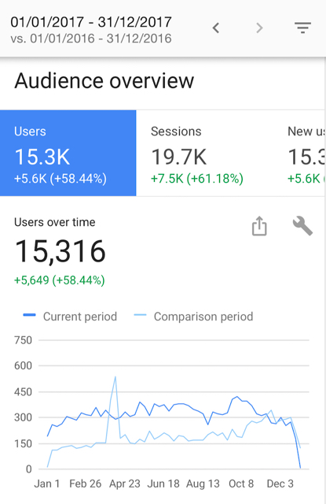
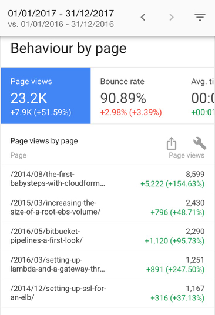

Looking back at this site in 2017 and giving an idea of what's to come in 2018.

# Looking Back at 2017

Last year I used the [first weekly note](/weekly-notes/week-2-2017/) to look back at the year and I decided to do the same this time. As it's the first of January it's also unlikely that a lot has happened between now and Christmas[^1].

So, let's start with a recap of my writing. I posted a total of 49 articles, 41 of them being weekly notes and the rest a mixture of regular articles, presentations (which tended to double as regular articles), and links to things I posted elsewhere. 

Starting at the end of August I tried to limit the size of the weekly notes to about 600 characters. This was done for a couple of reasons, partially to make it easier to read but also for me as a writing exercise where I try to be more succinct without losing anything. For the record, I failed with this for both the September Apple event and for re:Invent. 

I also didn't put every presentation I gave last year on the site. While the first half of the year this was because there weren't any, as I was to busy with organising the Golang Melbourne meetup, later on I simply failed to post some of them. That's not something I'm very happy about and I'll try to do better this year.

That said, let's look at the traffic. Using Google Analytics[^2], I can see about a 50-60% increase in traffic year over year depending on the metric being used. Still far from being high traffic though. Email and RSS subscriptions are still low enough not to really matter.

I also didn't have a repeat of a big spike due to having anything featured, probably because I didn't write any high profile articles. This also reflects in the most popular articles this year. Unsurprisingly most popular are still The First Babysteps with CloudFormation and Increasing the Size of an EBS Root Volume. 

Two of 2016's articles are also in the top 5, Bitbucket Pipelines: A First Look and Setting Up Lambda and a Gateway Through the CLI. It's good to see some newer writing there, where newer is actually not very new anymore.

# Looking Forward to 2018

But this all brings me to my plans for the site for this year. I intend to post a lot more content, going from an average of just below 1 per week to about 3 per week. 

This will still be on most weeks a weekly note[^3], but in addition a regular article as well as something new that you'll find out about later this week. I'm not entirely sure about the schedule, but probably spread out over the week on Monday, Wednesday, and Friday.

The volume of posts is still not going to be super high, but I included a third option to stay up to date by way of a [Twitter account](https://www.twitter.com/ignoreme_site).

I hope that I'll be able to provide you all with interesting content this year, and of course I wish you all a happy 2018!

[^1]:	Keep in mind I didn't write this on the first of January.

[^2]:	Which would be a lot nicer if it had a decent iPad version and was updated for the iPhone X.

[^3]:	And something to replace it if nothing interesting happened.
