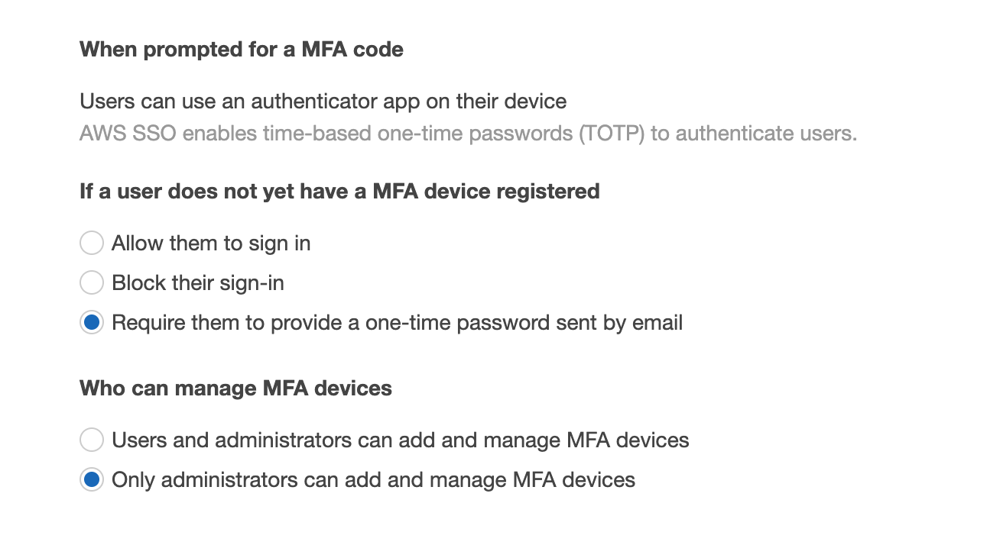
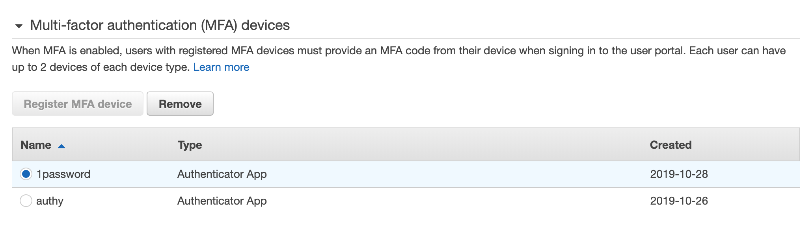
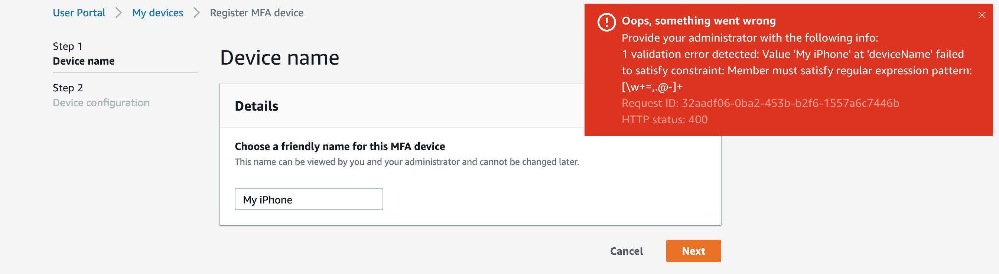

Instead of a normal weekly note, I decided to take a close look at the good and bad of the new device based MFA support in AWS SSO.

# AWS SSO MFA

For the past 7 or 8 months, I've been using [AWS SSO](https://aws.amazon.com/single-sign-on/) (AWS Single Sign-On) quite a bit. Both for personal use and with clients. During this time I've also built up quite a list of complaints I have about the service. Many of these I've already passed on to the service team, and I'm writing a blogpost[^1] about it as well.

That said, the [latest announcement for SSO](https://aws.amazon.com/about-aws/whats-new/2019/10/increase-aws-single-sign-on-security-with-multi-factor-authentication-using-authenticator-apps/) solves one of the major pain points it has[^2]. Up until late last week, MFA for SSO was supported but only by way of getting an email sent to you. Which isn't the most useful way of getting an MFA token for an SSO service. Most of the downsides are obvious; it's not considered as secure as a separate token on a different device, you literally can't put your email behind that same SSO[^3], and depending on your email servers these emails may take a long time to arrive. And even then might end up in your spam folder.

So, considering this is a major new feature for a service that is an important part of [Control Tower](https://aws.amazon.com/controltower/) it seems fair enough to take a close look at how well this new MFA works.

## Administration

Let's start with the administration of the feature. If you have MFA enabled for your users[^4] the ability to use device-based MFA is automatically enabled. Which is great! Less great is that for some reason it defaults to only allowing administrators to set this up for users. I honestly fail to understand the reasoning for this. Does AWS expect that every user can walk up to an administrator to set this up?

The other new setting is about how to behave when someone logs in without an MFA device configured. Falling back to email based authentication is an excellent default value here. It allows your users access, while still having some security. The other two options are to allow access regardless or to block users. These options fit with the rest of SSO, but are limiting from a security and compliance perspective. I would like to propose another option here: **Require them to provide a one-time password sent by email and force configuring of MFA device**. Which basically means that after logging in using the email provided token, the user *has* to set up an MFA device.

The other administration part is creating and deleting MFA devices for users. This is handled in a new section of the user information, and works for both Microsoft AD and AWS SSO directories. There is nothing exciting about this, so let's move on.

## Adding devices

As a user, adding a device is straightforward. There is a new link for *My devices* that shows you your existing devices, and lets you remove them or add a new one.

There are a couple of caveats here. Interestingly, you can only add or remove a device if you logged in in the past 5 minutes. This is a nice security feature to prevent people from setting up an MFA device when someone forgets to lock their screen[^5]. It won't remove that risk completely, but at least it makes it harder.

There is a limit of two devices that you can set up, and when you have both configured you can use the token from either device to log in. Now, as for setting up the device. I have got some complaints. Actually, it's one complaint with multiple sides to it.

You are directed to use a friendly name for your device, but if you have the temerity to include a space it will throw a big red warning informing you that you should tell your administrator that there was "1 validation error detected: Value 'My iPhone' at 'deviceName' failed to satisfy constraint: Member must satisfy regular expression pattern: [\\w+=,.@-+]". Aside from the fact that these limits make no sense for a name field, the error message is very unfriendly for users. Oh, and just in case you're wondering, the maximum allowed size for the friendly name is 255[^6].

Another issue I've got with this interface is its use of completely custom HTML elements. When you type in the device name or later on the verification MFA token, you can't press enter to go to the next screen. Instead you have to click the Next button. Lastly, and I admit this might just be me, why is the field to verify you've got the correct MFA token configured a password field? It would be far more user friendly if it was just a plain text field so people can verify they typed the right thing.

## Anything else

Actually using the token is straightforward and no different from any other service that requires it, so I don't have anything to say about that. But let's mention the other elephant in the room when it comes to SSO: it's complete lack of an API[^7]. If an administrator needs to invalidate a device because a user has a new phone, this has to be done by clicking through the interface. If an administrator wants to know how many users have actually set up a device, in order to tell them to do so, this can only be done by manually checking every user in the directory. In the interface. If you have a big Active Directory behind this, good luck with that[^8].

Also, while most of us treat our phones as the MFA device, it's worth pointing out that at this time there really is only support for so-called virtual devices. If you wish to use a hardware token, let alone something like a Yubikey, you're out of luck. To contrast, for IAM users hardware tokens have been supported from the start and [Yubikey and other U2F security keys since last year](https://aws.amazon.com/blogs/security/use-yubikey-security-key-sign-into-aws-management-console/).

All that aside however, I am very happy to see this feature and have pushed it for every SSO instance I've got control over. Unfortunately, right now I can only hope that users are setting up those devices, as I can neither see nor control that.

[^1]:	Yes, another promise for a blogpost that is hopefully coming soon.

[^2]:	And makes me remove a major section of that blogpost.

[^3]:	Access to your email as a requirement for accessing your email is... not optimal.

[^4]:	If not, please do so now.

[^5]:	Regrettable behaviour I still see on a daily basis.

[^6]:	I've tried this, and it certainly doesn't look friendly.

[^7]:	At this stage I'm treating CloudFormation as a pipe dream.

[^8]:	The chances of anyone having a big SSO directory are pretty slim, because that's all clickops as well.